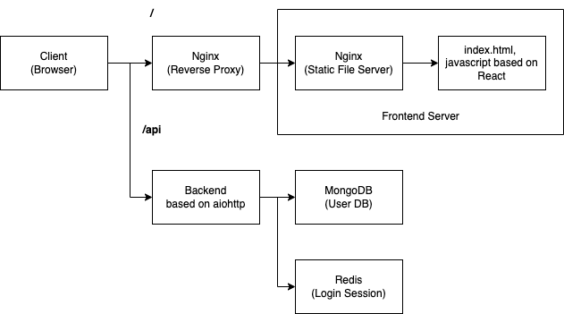

# Chat web app

Simple chatting web application built with multi-container for studying purpose.

## Specification

* Multi user, Single Room chatting implementation.

* Show each user's id, chatting message, chatting datetime.

* Using Redis for maintaining user's login sessions.

* Using Mongodb for storing user's information.

* Using nginx as static resource server in frontend.

* Using nginx as reverse-proxy server for load-balancing, and caching.

* Do not keep chatting messages.

* Implemented using socket.io (Web-socket) in the server, client both side.



## Set up

To run service, run below command.

```
$ docker-compose -f docker-compose-dev.yml up --build
```
